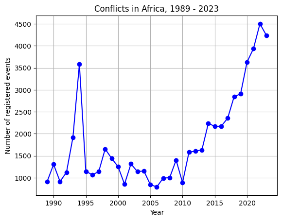
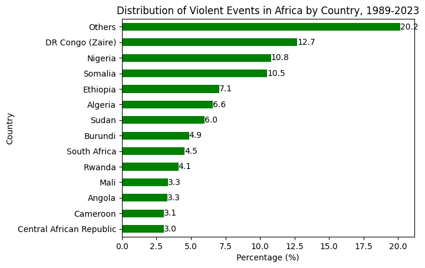

# Milestone 2

#### Project description: 

Conflict remains a major barrier to development, stability, and humanitarian well-being, particularly in regions affected by environmental stress and resource scarcity. Understanding and predicting the spatial and temporal dynamics of conflict events can provide critical insights for policymakers, aid organizations, and local communities to better allocate resources, anticipate humanitarian crises, and design targeted interventions. Africa, given its complex dynamics of resource-driven conflicts, economic inequalities, and climate-induced stress, serves as an ideal context to explore how environmental and socioeconomic factors interact and influence conflict risks. With this in mind, we seek to answer the following research question: 

**_Can the ocurrence of violence in a given geography be predicted using local socioeconomic and environmental data?_**

Note: We decided to change our research plan to one that more closely aligns with our interests an expectations for this class's skillset. 

#### Description of data sources: 

    - UCDP: the Upsala conflict data registers georreferenced records of conflicts around the world with specific latitude/longitude coordinates and dates.
    - ERA5 Reanalysis Data: Offers monthly aggregates and estimates of various atmospheric variables, including temperature, precipitation, and surface pressure, on a global (~31 km resolution).  
    - Meta Relative Wealth Index (RWI): Predicts relative standard of living within countries using de-identified connectivity data and satellite imagery.
    - Hansen Global Forest Change Dataset: Supplies annual data on global forest extent and change from 2000's onwards.
    - NASA VIIRS Nighttime Lights: Captures nighttime light emissions to offer insights into human settlements and economic activity.

To motivate our analysis, we provide a preliminary overview of our variable of interest (occurence of violent events in Africa). Between 1989 and 2023, the occurence of violent events across the continent was characterized by a sharp peak in 1994, followed by an intermittent decline through 2006, and culminated by a steady increase from 2010 onwards (Graph 1). Throughout this entire period, 13 out of the 46 countries in the dataset comprised the majority of violent events, with the DR Congo, Nigeria and Somalia making up more than one-third of all records (Graph 2).

##### Graph 1

##### Graph 2

#### Methodology for data cleaning, integration and features: 

We aim to divide the African continent in grids of 50km x 50km and locate the point geometries corresponding to conflict events contained within each grid cell. This would then allow us to define a true label for each grid cell as 'prone to conflict' or 'not prone to conflict' for a specific year based on the occurence of at least one conflict. We would then match environmental and socioeconomic features from auxiliary datasets to each grid cell. To enhance our feature set, we will extract two aditional features: 

1. the year-over-year change in nighttime light intensity, serving as a proxy for economic development or decline.
2. the anomalies in temperature measured as temperature abnormally high or low (1 std deviation from long term trend)

This feature set would be used to implement the supervised classification model exploring whether the occurence of a conflict within a geography can be reasonably predicted based on its environmental and socioeconomic factors. By integrating these features, the project will produce meaningful insights into the drivers of conflict, facilitating accurate predictions and actionable strategies for prevention and mediation.

Data cleaning steps will involve checking for missing values, ensuring consistent data types and units, and normalizing data distributions where necessary.

#### Consolidated feature set to predict conflict: 

    - Conflict prevalence:
        - Conflict occurrence (binary label)
        - Number of conflict events in prior years

    - Climate and Environmental Variables:
        - Average annual temperature
        - Max anual temperature
        - Annual precipitation totals
        - Surface pressure (mean annual values)
        - Forest cover loss (annual % change from Hansen dataset)
        - [new feature] Temperature anomaly (binary feature indicating abnormal deviation from historical norms)

	- Socioeconomic Variables:
        - Relative Wealth Index (average RWI within grid)
        - Nighttime lights intensity (annual mean)
        - [new feeture] Year-over-year change in nighttime light intensity (economic growth proxy)

